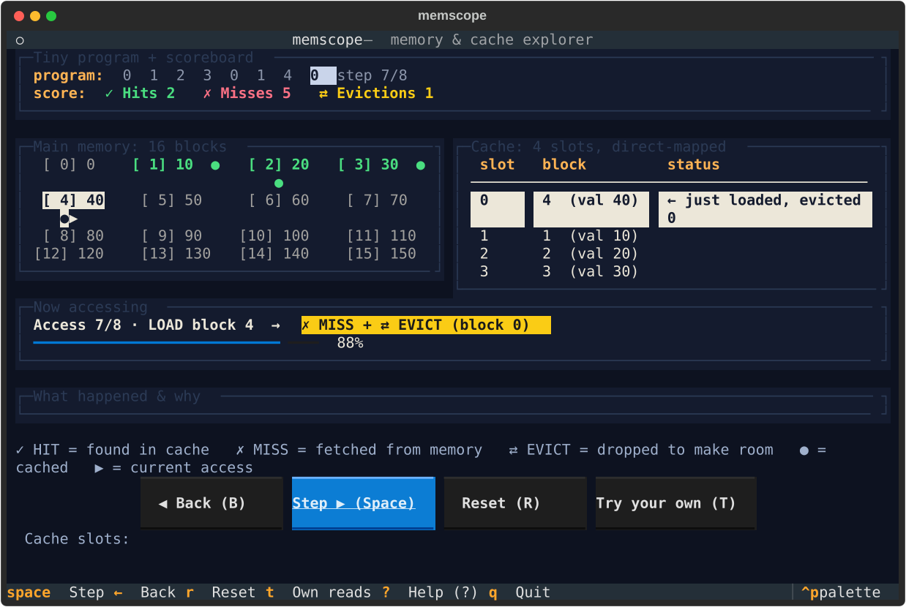

# memscope: memory and cache explorer



A small terminal app for students starting computer engineering: step through a
short program's memory reads and watch cache hits, misses, and evictions.

- 16 memory blocks, direct-mapped cache (`slot = block mod N`)
- Guided demo: built-in 8-access sequence with 4 slots that walks through cold
  misses, then hits, then a conflict eviction and the miss after it (about 2 min)
- Try your own: press `T`, type any block 0-15, each read is explained the same
  way; cache size 2/4/8 slots (changing it resets everything)
- Keyboard and mouse: click the buttons or use the keys below

## Install and run (Windows PowerShell)

```powershell
git clone https://github.com/Siguatepeque/memscope.git
cd memscope
py -m pip install --user pipx
py -m pipx ensurepath
py -m pipx install .
```

Then open a new PowerShell window (so `pipx` is on PATH) and run:

```powershell
memscope
```

After local changes, run this from the cloned project folder to refresh the
installed copy:

```powershell
pipx install --force .
```

Run the tests (uses only the standard library, no extra test deps):

```powershell
py -m unittest discover -s tests
```

## Keys

| Key | Action |
| --- | ------ |
| `Space` / `→` / `N` | Step one access (guided demo / replay) |
| `←` / `B` | Step back |
| `R` | Reset and replay (in try your own, clears your reads) |
| `T` | Switch between guided demo and try your own |
| `Enter` | Submit a typed block (in try your own) |
| `2` / `4` / `8` | Cache slots (resets everything) |
| `?` | Help overlay (`Esc` closes) |
| `Q` | Quit |

Status is always words + symbols (✓ HIT, ✗ MISS, ⇄ EVICT), never color alone.
